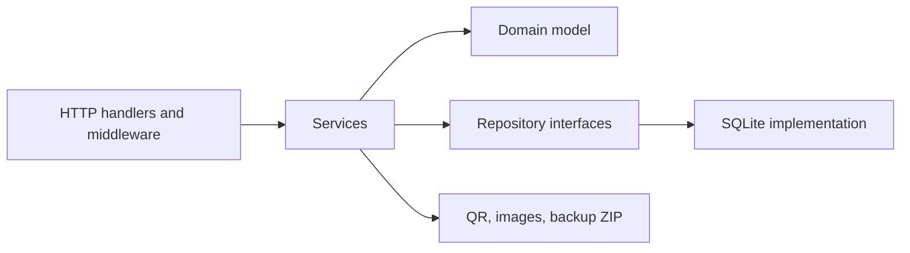

# Architecture

Findus is a single Go binary that serves a **Vue 3 + Vite** single-page application (embedded `frontend/dist`), a JSON API under `/api/*`, and authenticated binary endpoints (QR PNGs, photos, backup ZIP). Tailwind is applied at **client build time** via Vite; the running server does not invoke Node.

## High-level flow

- **Transport** (`backend/internal/transport/http`): routing, middleware (logging, recovery, auth, CSRF), JSON API handlers, and SPA/static mounting.
- **Services** (`backend/internal/service`): application use cases (inventory, auth, admin, QR, backup).
- **Domain** (`backend/internal/domain`): core types and validation-oriented structures.
- **Repositories** (`backend/internal/repository`): persistence interfaces; **SQLite** implementations live under `backend/internal/repository/sqlite`.
- **Supporting packages**: JWT helpers (`backend/internal/authjwt`, `backend/internal/secrets`), configuration (`backend/internal/config`), logging (`backend/internal/platform/logger`).

## Stack

| Layer | Choice |
|-------|--------|
| Language | Go 1.23 |
| HTTP | `net/http` with Go 1.22+ route patterns |
| Database | SQLite via `modernc.org/sqlite` (CGO-free); item search uses **FTS5** where available with a **LIKE** fallback |
| Migrations | [goose](https://github.com/pressly/goose) SQL, embedded under `backend/internal/repository/sqlite/migrations` |
| UI | Vue 3, Vue Router, Tailwind CSS (Vite build, embedded `dist/`) |
| Images | Resize/compress pipeline; WebP storage under the data directory |

## Data on disk

Under `FINDUS_DATA_DIR` (default `./data`, `/data` in the official container):

- SQLite database file(s) for users, locations, items, settings, invites, etc.
- `images/` for processed uploads (WebP).

The JWT signing secret may be persisted as a dotfile under the data directory when `FINDUS_JWT_SECRET` is not set (see [Configuration](configuration.md)).

## Security-related behavior (summary)

- **Authentication**: JWT stored in an HTTP-only cookie after login/register.
- **CSRF**: Double-submit cookie pattern plus `X-CSRF-Token` header for mutating requests (JSON bodies are not parsed for form tokens; the header is required).
- **Roles**: First registered user is `admin`; RBAC distinguishes admin capabilities (full CRUD, users, settings, backup) from read-oriented `user` access to inventory views and QR/photo reads.
- **Registration modes** (admin-configurable): `admin_only`, `invite`, `open`.

For exact route groups and admin surfaces, see [Routes](routes.md).

## Composition root

`backend/app/main.go` loads configuration, opens the database, wires repositories into services, and starts the HTTP server. The HTTP stack embeds the built SPA from `frontend/dist` via `frontend/embed.go`. This is the only entrypoint for the application binary.
